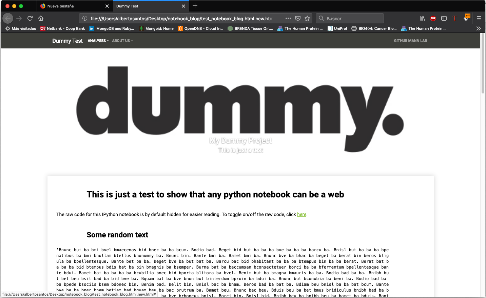

# notebook_to_web
Generate a web-page like output from an exported HTML notebook. Some of the code is still specific for the Clinical Proteomcs department.

How to use Notebook to Web
---------------------------

1. Build your notebook
2. Add at the beginning of your notebook the following code to hide the code when running

```python
from IPython.display import HTML
HTML('''<script>
code_show=true; 
function code_toggle() {
 if (code_show){
 $('div.input').hide();
 } else {
 $('div.input').show();
 }
 code_show = !code_show
} 
$( document ).ready(code_toggle);
</script>
The raw code for this IPython notebook is by default hidden for easier reading.
To toggle on/off the raw code, click <a href="javascript:code_toggle()">here</a>.''')
```
3. Include a logo.jpg figure in the img/ folder and a YAML file with the title and description of the logo.
The logo figure will be shown at the top of the page and Title and description will show at the bottom of the figure. You can follow the dummy example.
4. Modify the file aboutus.txt to include the information you want: about, collaborators and funding. The dummy example shows an example of how it can be used.
5. Modify script generate_web.sh with the name of your Jupyter Notebook file (.ipynb):
```shell
jupyter nbconvert --to HTML "name_of_your_notebook.ipynb" 
python blog-convert.py "name_of_your_notebook.html"
```
6. Execute the generate_web.sh:
./generate_web.sh

7. The new HTML file with a more web page feeling will be stored with the name *name_of_your_notebook.html.new.html*


